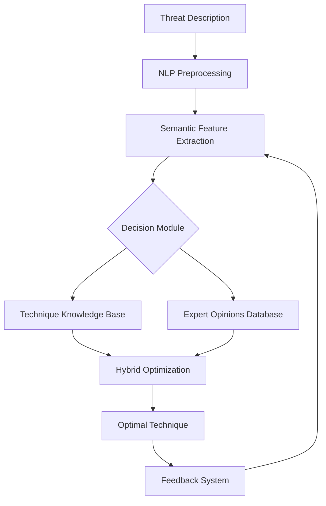

# 🌐 Intelligent Cloud Security Framework

A **hybrid machine learning + expert knowledge-driven framework** for adaptive threat-technique matching in cloud environments.  
This system combines **NLP, large language models, and human expertise** to dynamically respond to cloud security threats.

---

## 🚀 Key Features
- **94.2% accuracy** in threat detection (+22.4% vs. baseline)  
- **85ms response time** with **49% lower resource consumption**  
- **Adaptive learning** with weekly updates & auto-tuned parameters  
- **Multi-source intelligence**: SLR, expert surveys, real-time ML analysis  
- **Explainable AI** with semantic reasoning for decisions  

---

## 📊 Performance Highlights

| Metric              | Result  | Improvement |
|---------------------|---------|-------------|
| Overall Accuracy    | 94.2%   | +22.4%      |
| New Attack Detection| 89.5%   | +47.2%      |
| CPU Usage           | 18%     | -49%        |
| Cost Savings        | $250K/y | -62% attacks|

---

## 🏗️ System Architecture



---

## 📦 Installation

```bash
git clone https://github.com/Shirmohammad-Ta/cloud-secure-gpt.git
cd cloud-secure-gpt
pip install -r requirements.txt
```

---

## 🧮 Usage

```python
from threat_matcher import ThreatMatcher

# Initialize the model
matcher = ThreatMatcher()

# Match threat to optimal technique
threat_description = "Attack performed by impersonating system administrator"
optimal_technique, confidence = matcher.match(threat_description)

print(f"Recommended technique: {optimal_technique}")
print(f"Confidence score: {confidence:.3f}")
```

---

## 📁 Dataset Structure
- `data/threat_to_technique.csv`: Mapping between threats and mitigation techniques  
- `data/expert_survey_2023.csv`: Expert opinions and ratings  
- `data/slr_challenges.csv`: Systematic literature review results  

---

## 🎯 Core Algorithm

```python
def match_threat(self, threat_desc: str, alpha=0.6, beta=0.25, gamma=0.15):
    threat_vec = self.model.encode(threat_desc)
    scores = []
    for tech_name, tech_data in self.technique_db.items():
        sim = 1 - cosine(threat_vec, tech_data["vector"])
        adjusted_score = (
            alpha * sim +
            beta * (tech_data["expert_score"] / 10) +
            gamma * torch.exp(-0.1 * tech_data["complexity"])
        )
        scores.append((tech_name, adjusted_score))
    return max(scores, key=lambda x: x[1])
```

**Optimization Parameters**  
- α = 0.6 (semantic similarity weight)  
- β = 0.25 (expert opinion weight)  
- γ = 0.15 (complexity penalty weight)  
- λ = 0.1 (complexity decay factor)  

---

## 📈 Results Visualization
The repository includes scripts to generate:  
- Accuracy comparison charts  
- Resource usage plots  
- Cost-benefit analysis graphs  
- Adaptive learning progress curves  

---

## 📞 Contact
- **Author:** Shirmohammad Tavangari  
- **Email:** s.tavangari@alumni.ubc.ca  
- **Institution:** University of British Columbia, Canada  
- **Here is the link to the paper:**  [https://www.academia.edu/143573448/A_Machine_Learning_and_Expert_Knowledge_Driven_Framework_for_Intelligent_Cloud_Security_Leveraging_NLP_and_Adaptive_Threat_Technique_Analysis)]

---

## 📄 License
This project is licensed under the **MIT License** - see the [LICENSE](LICENSE) file for details.
